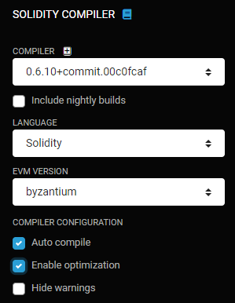

# ALASTRIA Red T #
[](https://github.com/alastria/alastria-node/blob/testnet2/LICENSE)
[](https://alastria.slack.com/)


* Visit [What is alastria](https://alastria.io/en/) page to know more about us.

This page contains technical information needed to work in the Alastria ecosystem on the possible different ways.

You'll need at least a host/node to interact with the network, please read the technical requirements for it.

[//]: # ( Para ello, necesitarás como mínimo un nodo para poder intercatuar, ese nodo ha de tener por lo menos las siguientes especificaciones: )

## System requirements

**Operating System**: Ubuntu 16.04 64 bits; Ubuntu 18.04 64 bits

**Hardware**:

| Hardware | minimum | desired |
|:------- |:-------- |:---------|
| **CPU's**: | 2 |  4 |
| **Memory**: | 4 Gb |  8 Gb |
| **Hard Disk**: | 100 Gb |  1000 Gb |


#### TCP/UDP PORTS

You'll need to open the following ports in your firewall inbound and outbound to deploy a node:

[//]: # (También es necesario habilitar los siguientes puertos de E/S en la maquina en la que vamos a desplegar el nodo:)

| Port | Type | Definition |
|:------:|:-----:|:---------- |
|21000| TCP/UDP | Geth process application port (inbound and outbound for ethereum traffic) |
|9000| TCP | Constellation port (private transactions, inbound and outbound)|
|80| TCP | Outbound for Websockets feed to netstats server |
|80 and 443| TCP | Inbound RPC Port if using the automatic installation with Alastria Open Access Component|
|8086 | TCP | Outbound for InfluxDB statistics collection |

#### IP ADDRESSES

The IP resulting out of the installation process (e.g. the IPv4 part of the enode) , must not be an RFC1918 IPv4 address

10.0.0.0/8
172.16.0.0/12
192.168.0.0/16

These IP addresses are non-routable and will result in your node being unreachable and unable to participate in the blockchain.

In case the installation process yields a non-routable IP address, you must verify if your node is behind a firewall, in which case you might use the firewall's external address only in the case the firewall provides for Full-cone NAT. 

Restricted-Cone NAT has not been tested yet for p2p functionality.

## Installation & configuration of

### [Regular node] Quorum node + Constellation + Access point + Monitor

* [(English) Installation Guide](https://medium.com/babel-go2chain/setting-in-motion-a-regular-node-in-the-telsius-network-of-alastria-c2d67b8369c7)
* [(Spanish) Installation Guide](https://medium.com/babel-go2chain/c%C3%B3mo-poner-en-marcha-un-nodo-regular-en-la-red-telsius-de-alastria-876d9dcf7ccb)
* Repository of the access-point that comes installed inside the docker of the regular node [Access-point](https://github.com/alastria/alastria-access-point)

### [Regular node] Quorum node installation using Ansible from host machine

* [(English) Installation Guide](https://github.com/alastria/alastria-node/blob/testnet2/ansible/README.md)

### [Validator node] Quorum node + Access point + Monitor

* [(English) Installation Guide](https://medium.com/babel-go2chain/setting-in-motion-a-validator-node-in-the-telsius-network-of-alastria-906629bc6920)
* [(Spanish) Installation Guide](https://medium.com/babel-go2chain/c%C3%B3mo-poner-en-marcha-un-nodo-validador-en-la-red-telsius-de-alastria-676bdccc253a)

### [Bootnode node] Quorum node

* [(English) Installation Guide](https://medium.com/babel-go2chain/setting-in-motion-a-bootnode-in-the-telsius-network-of-alastria-8e13915cb85d)
* [(Spanish) Installation Guide](https://medium.com/babel-go2chain/c%C3%B3mo-poner-en-marcha-un-bootnode-en-la-red-telsius-de-alastria-18eacb20b224)

## Deployment of Smart Contracts on Alastria Network
To know more about the use of Alastria Network, you can visit the Smart Contract Deployment Guides:
* [Deploying to Alastria's network T (Quorum)](https://github.com/rogargon/copyrightly.io/blob/master/docs/NetworkT.md), created by Roberto Garcia, from Lleida University
* [Deploying to Alastria's Red T using Remix & Metamask](https://medium.com/@jmolino/como-desplegar-un-smart-contract-en-la-red-t-de-alastria-utilizando-remix-y-metamask-782463997a34) created by Jose María del Molino, from AYESA
* [Deploying to Alastria's Red T using Truffle (Quorum)](https://medium.com/babel-go2chain/como-desplegar-un-smart-contract-contra-la-red-t-de-alastria-56939034e884) created by Guillermo Araujo, from Babel

(**IMPORTANT**) Be aware that the actual's Alastria network EVM version is *byzantium* and , therefore, the Smart Contracts **must** be compiled for this EVM's versión:

- Remix: 

  

- Truffle: in truffle.js configuration file

  ```js
  compilers: {
      solc: {
        version: "0.5.17", // A version or constraint - Ex. "^0.5.0"
        settings: {
          optimizer: {
            enabled: true,
            runs: 100   // Optimize for how many times you intend to run the code
          },
          evmVersion: "byzantium" // for T network
        }
      }
    }
  ```

- Buidler: in buidler.config.ts configuration file

  ```typescript
  const config: BuidlerConfig = {
    solc: {
      version: '0.5.17',
      evmVersion: 'byzantium',
      optimizer: {
        enabled: true,
        runs: 100
      }
    },
  ```


## Connection from External Applications using WebSockets
* [Connecting to an Alastria's Red T node using WebSockets](https://tech.tribalyte.eu/blog-websockets-red-t-alastria) created by Ronny Demera, from Tribalyte

## Checking Node's Health

In order to check if your node is operational, you can establish monitoring based on your node's ingress and egress P2P traffic during the last 5 minutes.

As soon as the node comes up, e.g. starts to run, it will send metrics points to Alastria InfluxDB server.

These are queries to the InfluxDB API you can translate into your preferred language and/or framework:

Ingress traffic:
```
curl -G 'http://geth-metrics.planisys.net:8086/query?pretty=true' --data-urlencode "db=alastria" --data-urlencode "user=EDITED_USER" --data-urlencode "password=EDITED_PASSWORD" --data-urlencode "q=select mean(m1) from \"geth.p2p/InboundTraffic.meter\" where (time > now()-5m AND host =~ /^REG_YOUR_NODE_NAME$/)"
```

Egress traffic:
```
curl -G 'http://geth-metrics.planisys.net:8086/query?pretty=true' --data-urlencode "db=alastria" --data-urlencode "user=EDITED_USER" --data-urlencode "password=EDITED_PASSWORD" --data-urlencode "q=select mean(m1) from \"geth.p2p/OutboundTraffic.meter\" where (time > now()-5m AND host =~ /^REG_YOUR_NODE_NAME$/)"
```

The output are jsons that need to parsed and look like this (value is a pair where the second field should be > 0)

```
{
    "results": [
        {
            "statement_id": 0,
            "series": [
                {
                    "name": "geth.p2p/OutboundTraffic.meter",
                    "columns": [
                        "time",
                        "mean"
                    ],
                    "values": [
                        [
                            "2020-06-15T08:40:12.772770668Z",
                            1225.7697298713392
                        ]
                    ]
                }
            ]
        }
    ]
}
```


## Alastria network resources

[//]: # ( Aquí encontrarás una lista con enlaces a diferentes servicios de la red alastria, netstats, blockexplorers, etc. )

List of links with resources for the Alastria Network

* **WIKI**
	* [Home](https://github.com/alastria/alastria-node/wiki)
	* [F.A.Q.](https://github.com/alastria/alastria-node/wiki/FAQ_INDEX_EN)

* **Resources**
	* [Network Monitors (ethnetstats)](https://github.com/alastria/alastria-node/wiki/Links)
	* [Blockexplorers](https://github.com/alastria/alastria-node/wiki/Links)
	* [Access-point](https://github.com/alastria/alastria-access-point)

* **¿Need Help?**
	* [Slack](https://github.com/alastria/alastria-node/wiki/HELP)
	* [Github (use & governance)](https://github.com/alastria/alastria-node/wiki/HELP)
