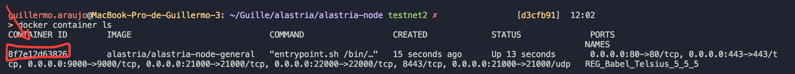
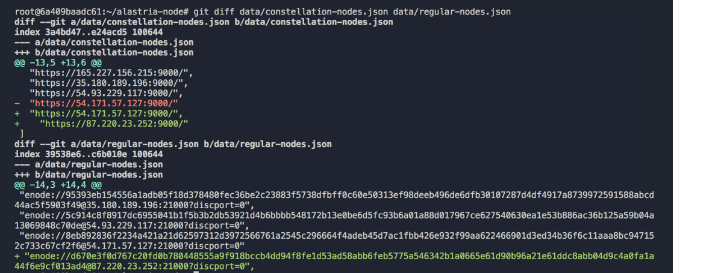

# Alastria Node Docker

In the Telsius network there are 3 types of nodes.
* Validators: They are in charge of the mining and validation of the blocks using the IBFT consensus algorithm.
* Bootnodes: They are responsible for the permission of the nodes in the network.
* Regular: They are responsible for accepting transactions, verifying them and delivering them to the “validator”.

## System requirements

Requirements to be able to launch a node of any type with docker:

**Operating System**: Ubuntu 16.04 64 bits

**Hardware**:

| Hardware | minimum | desired |
|:------- |:-------- |:---------|
| **CPU's**: | 2 |  4 |
| **Memory**: | 4 Gb |  8 Gb |
| **Hasrd Disc**: | 100 Gb |  1000 Gb |

**Software**:

Have installed docker in the machine. If you need documentation on how to install docker in ubuntu you can follow the official docker guide exposed in the following link: [install-docker](https://docs.docker.com/install/linux/docker-ce/ubuntu/).


## Launch a general/regular node
Navigate to *docker/general/*
Run the command:
```
./init.sh
```
Answer all the questions.

When the script has finished it will be necessary to make a Pull Request to the corresponding repository and branch so that the core team can review the information and add it to the permission.

The corresponding repository is [alastria-node](https://github.com/alastria/alastria-node/tree/testnet2) and the branch will be testnet2.

The files to be modified will be:
* DIRECTORY_REGULAR.md
* data/constellation-nodes.json
* data/regular-nodes.json

To connect to the docker and get the value of your enode and the IP corresponding to your machine you can do it in the following way.

```
docker container ls
```
With what the command shows us we can obtain the ID of the docker container where our node has been launched as shown in the following image.



Once the containerID is obtained, we can access it through the following command.

```
docker exec -it CONTAINER_ID /bin/bash
```

The information corresponding to our node can be obtained by executing the git diff command inside our node in *~/alastria-node*



## Launch a validator node
Navigate to *docker/validator/*
Run the command:
```
./init.sh
```
Answer all the questions.

When the script has finished it will be necessary to make a Pull Request to the corresponding repository and branch so that the core team can review the information and add it to the permission.

The corresponding repository is [alastria-node](https://github.com/alastria/alastria-node/tree/testnet2) and the branch will be testnet2.

The files to be modified will be:
* DIRECTORY_VALIDATOR.md
* data/validator-nodes.json

To connect to the docker and get the value of your enode and the IP corresponding to your machine you can do it in the following way.

```
docker container ls
```
With what the command shows us we can obtain the ID of the docker container where our node has been launched as shown in the following image.


Once the containerID is obtained, we can access it through the following command.

```
docker exec -it CONTAINER_ID /bin/bash
```

The information corresponding to our node can be obtained by executing the git diff command inside our node in *~/alastria-node*


## Launch a bootnode node
Navigate to *docker/bootnode/*
Run the command:
```
./init.sh
```
Answer all the questions.

When the script has finished it will be necessary to make a Pull Request to the corresponding repository and branch so that the core team can review the information and add it to the permission.

The corresponding repository is [alastria-node](https://github.com/alastria/alastria-node/tree/testnet2) and the branch will be testnet2.

The files to be modified will be:
* DIRECTORY_BOOTNODES.md
* data/boot-nodes.json

To connect to the docker and get the value of your enode and the IP corresponding to your machine you can do it in the following way.

```
docker container ls
```
With what the command shows us we can obtain the ID of the docker container where our node has been launched as shown in the following image.


Once the containerID is obtained, we can access it through the following command.

```
docker exec -it CONTAINER_ID /bin/bash
```

The information corresponding to our node can be obtained by executing the git diff command inside our node in *~/alastria-node*


## Scripts
In the directory *docker/scripts/* you can find all the pre-fabricated scripts that you can run on your docker container of the node.
### Start docker node
```bash
./start.sh
```
### Stop docker node
```bash
./stop.sh
```
### Update docker node
```bash
./update.sh
```
### Destroy docker container (but persist the volume)
```bash
./destroy_docker.sh
```
### Launch docker container with same volume and Identity
```bash
./launch_docker.sh
```
### Update docker image from docker hub and relaunch the node
```bash
./update_docker.sh
```
### Full backup (keys and chain data)
```bash
./backup.sh all
```
### Backupt Keys only
```bash
./backup.sh keys
```

### Full backup (keys and chain data)
```bash
./backup.sh all
```
